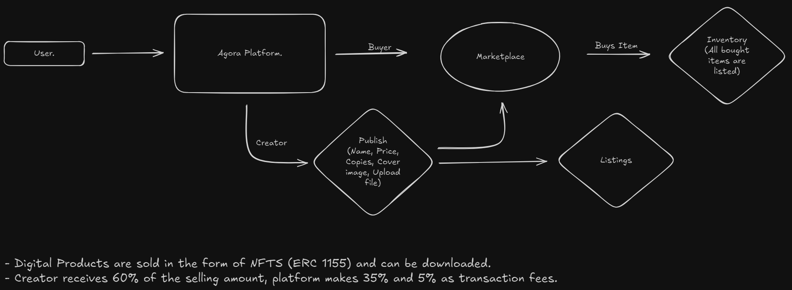

# Agora

A decentralized application that provides a platform for creators to sell their digital content and users to buy them using cryptocurrency.


## ⚠️ Problem to Solve

Creators face challenges in monetizing their digital goods, often relying on centralized platforms with high fees and limited transparency. There’s a growing need for a decentralized solution that empowers creators to directly sell their content and allows users to make secure purchases using cryptocurrency.

## ✅ Possible Solution

**Agora** addresses these issues by offering a decentralized platform for creators and users with:

1. **Tokenized Digital Goods:** Allows creators to mint their digital goods as ERC-1155 tokens, setting custom supply limits.
2. **Inclusive Access:** Supports both web2 and web3 social logins for a seamless user experience.
3. **Decentralized Marketplace:** Enables users to browse, discover and purchase digital goods directly from creators.
4. **Blockchain Security:** Leverages the Ethereum blockchain for secure, transparent transactions.

## ⚙️ Architecture.


[Excalidaw File...](https://excalidraw.com/#json=mHHar1KV7uz_dujZqnMgh,IzC-D9BPB3BPRUG_B0Z_Kg)

## 🛠 Tools, Languages & Frameworks Used

- **ReactJS:** Frontend library for building user interfaces.
- **Ether.js:** JavaScript library to interact with the Ethereum blockchain.
- **Solidity:** Programming language for writing smart contracts.
- **Hardhat:** Development environment for Ethereum-based smart contracts.

## 👨‍💻 Project Building Steps

1. Build the user interface and set up routes.
2. Set up wallet integration for web3 transactions.
3. Develop and deploy smart contracts on the Ethereum blockchain.
4. Integrate ERC-1155 tokens for minting digital goods.
5. Implement web2 and web3 login options.
6. Create a homepage for browsing and purchasing digital goods.
7. Test, debug and deploy the application.

## 📂 Folder Structure

- **client:** Contains the frontend codebase.
- **server:** Contains the Solidity smart contracts & scripts for deploying and testing contracts.

## 🧑‍💻 Contributions to this repo are WELCOME ⚡👋

- 🎨 **UI/UX Improvements:** Suggestions and enhancements to the design are welcome.
- 🔨 **Bug Reporting:** Test the platform extensively and report any bugs. If there’s no open issue for a bug, create one.

## 🔃 Steps to Contribute 🍀

1. **Fork the Repository:** Click on the fork button on the [Agora](https://github.com/mrinnnmoy/Agora) repo page to create a copy of the repository in your GitHub account.

2. **Clone the Forked Repository:**

   ```bash
   git clone "https://github.com/<your-github-username>/Agora"
   ```

3. **Install Dependencies:**

   - Download and install Node.js v16.16.0.
   - Download and install Git.
   - Navigate to the project folder and run:
     ```bash
     npm install
     ```
   - Start the development server:
     ```bash
     npm run dev
     ```

4. **Make Changes and Commit:**

   - Always create a new branch for changes:
     ```bash
     git checkout -b feature/<branch-name>
     ```
   - Add and commit your changes:
     ```bash
     git add .
     git commit -m "<commit-message>"
     ```

5. **Push Changes:**

   ```bash
   git push origin feature/<branch-name>
   ```

6. **Create a Pull Request:**
   - Go to your repository on GitHub, click on `Compare & pull request`, and provide a summary of your changes.
   - Attach relevant images or examples if necessary.

## ❤️ We appreciate all your contributions and feedback! 🎉
